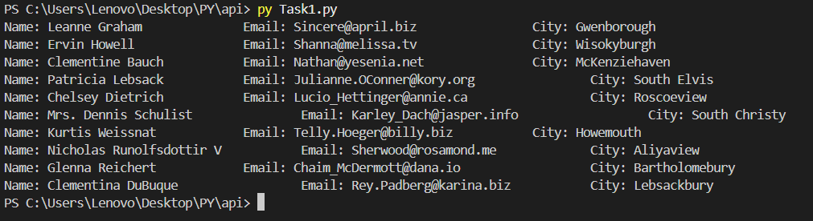
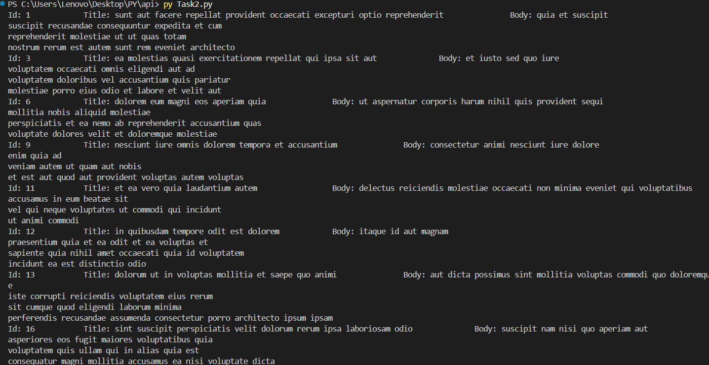
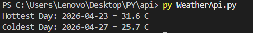

**This files contains everything i learnt about API and task related to it.**
# Task 1:
This task uses JSONPlaceholder API to fetch a list of users. By this task I learned to fetch data from API, check if the request worked, and display the data in terminal. 
**Output** 

# Task 2:
This task uses JSONPlaceholder API to fetch posts. I learned how to extract required data and store them in csv files. In this task, id, title and body were fetched. Also the csv file thus created was used to data filtering title where word in title exceeds 5. 
**Output** 

# Task 3:
This task uses Open-Meteo weather API to fetch 7-Day weather forecast for Kathmandu. It was done by setting params like longitude, latitude and daily. The data were stored in csv file and also hottest day and coolest day were analysed.

